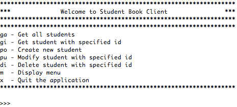
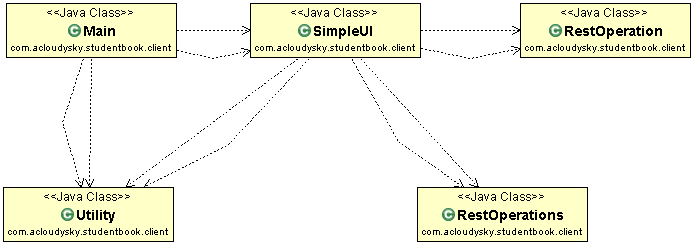

# Student Book Service Client
The **student-book-service-client** is a Java application that shows how to interact with **student-book-service** using its REST API. 

## Overview
The *student-book-service-client* is a console application written in Java that allows a user to select one of secral REST methods supported by the **student-book-service-service**. 
The first time the user starts the application she is presented with the following menu of possible choices:

For example, if the user enter **ga** (get all), the client app issues a REST GET call to the service which returns the stored information for all students, such as:

	{
	  "id" : 10001,
	  "name" : "George Washington",
	  "email" : "georgew@email.com",
	  "phoneNumber" : "253 222 3456"
	}, {
	  "id" : 10002,
	  "name" : "Lucas Davenport",
	  "email" : "lucasd@email.com",
	  "phoneNumber" : "425 123 4567"
	}, {
	  "id" : 10003,
	  "name" : "Mary Smith",
	  "email" : "marys@email.com",
	  "phoneNumber" : "360 234 5678"
	}, {	"id":10007,
		"name":"mike smith",
		"email":"mikes@gmail.com",
		"phoneNumber":"253 333 4444"
	}

### Prerequisites
To build the client app you need the following:

- [Maven 3.0+](https://maven.apache.org/download.cgi) as your build tool.
- Your favorite IDE. We use [Eclipse](https://www.eclipse.org/).
- [JDK 1.8+](https://www.oracle.com/technetwork/java/javase/downloads/jdk8-downloads-2133151.html).

📝You can download the
<ul>
	<li><b>student-book-client</b> project on GitHub at this loaction: <a href="" _target="_blank">TBD</a>
	</li>
	<li><b>student-book-service</b> project on GitHub at this loaction: <a href="*" _target="_blank">TBD</a></li>
</ul>

## Client Details
The student-book-service-client is a console application written in Java that allows a user to select one of secral REST methods supported by the **student-book-service-service**. 
The following is the client class diagram:

### Client Architectural Elements

- **Main**.  Initializes the application and the UI classes. Displays the selection menu. Starts the menu loop to allow the user to make the selection.
- **SimpleUI**. Displays a selection menu for the user. Processes the  user's input and calls the proper method based on the user's selection. Each method calls the related student-book-service REST API.
-  **RestOperations**. Performs REST operations using the the service **StudentResource** class. Each method calls the related student-book-service REST API. 
In particular it uses the **Spring Boot** framework. For more information, see [Spring Boot Restful Client with RestTemplate example](https://o7planning.org/en/11647/spring-boot-restful-client-with-resttemplate-example#a13887020)
- **RestOperation**. Performs REST operations using the service StudentResource class. Each method calls the related student-book-service REST API. In particular it uses the Apache Http client. For more information, see [Simple REST Client in Java](https://www.javacodegeeks.com/2012/09/simple-rest-client-in-java.html) 
- **Utility**. Defines utility methods and variables to support the application operations such as menu creation, list initialization and so on.

## Using the App

### Run the Service App

🚨To run the client app, you must assure first that the related service is up and running on the localhost port 8282.

1. In Eclipse, right click on the **student-book-service** server app.
1. From the drop down menu select **Run As->Spring Boot App**, as shon in the following figure.
 </img>
3. If the port 8282 on which the service must run is busy perform the following steps (on Mac):

		>> sudo lsof -i tcp:8282 /* display the processes running on port 8282 */
		>> kill -9 p#1 p#2 /* Kill the processes specified by their Id numbers. 

4. Finally restart the service,

### Run the Client App
4. Right click on the on the **student-book-client** server app.
5. Finally restart the service,
4. From the drop-down menu select on the **student-book-service** server app.
5. Click **Next**.
5. In the displayed *Runnable JAR File Specification* enter launch configuration information you defined in Eclipse to lunch the app. Also, enter the loaction where to export the JAR. Finally, check *Package required libraries...* 
</img>
6. Open a terminal window and execute a command similar to the following:

		java -jar studentbook.jar

## References
- [Spring Boot Restful Client with RestTemplate example](https://o7planning.org/en/11647/spring-boot-restful-client-with-resttemplate-example#a13901576)
- [Springfox Reference Documentation](https://springfox.github.io/springfox/docs/current/)
- [Simple REST client in Java](https://www.javacodegeeks.com/2012/09/simple-rest-client-in-java.html)
